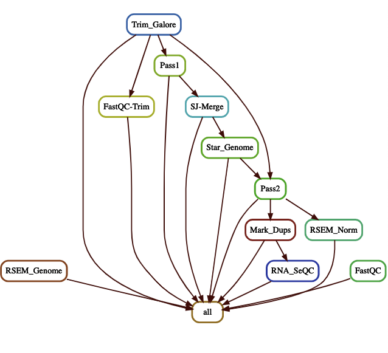

# RNA-Seq-Flow

RNA-Seq analyis using STAR two pass mode for alliging the raw reads and RSEM for transcript quantification using snakemake workflow.
  
    

## Required Tools  

 * [FastQC](https://www.bioinformatics.babraham.ac.uk/projects/fastqc/) (A quality control tool for high throughput sequence data)

 * [Trim-galore](https://www.bioinformatics.babraham.ac.uk/projects/trim_galore/) (Automates quality  control and adapter trimming of fastq files)

 * [STAR](https://github.com/alexdobin/STAR) (Spliced aware ultrafast transcript alligner to reference genome)

 * [Picard](https://broadinstitute.github.io/picard/) (Cammand line set  tool to manipulate high-throughput sequencing data)

 * [RNA-SeQC](https://software.broadinstitute.org/cancer/cga/rna-seqc) (Qualiy Control metrices of RNA-Seq data)

 * [RSEM](https://github.com/deweylab/RSEM) (Accurate quantification of gene and isoform expression levels from RNA-Seq data)


## Setting up conda environment for tools and their dependencies 

* Install [anaconda](https://docs.anaconda.com/anaconda/install/) or load it if it's already on your server

* conda create --name rnaseq-env

* source activate rnaseq-env

* conda install -c bioconda star

* conda install -c bioconda fastqc

* conda install -c bioconda rsem

#### Use STAR to index the genome for 1st pass allignment, the 2nd pass allignemnt uses the new index from merged SJ.out.tab files from the  script
```
 STAR  --runMode genomeGenerate --runThreadN 24 --genomeDir ./ --genomeFastaFiles hg38_noALT_noHLA_noDecoy_ERCC.fa 
```

#### Generate the combined fastqc report of all the samples (.txt)" 
```
 python3 fastqc-summary -s $INDIR > "QC_Report.txt"
```
#### The ERCC GTF file was download from [broadInstitute](https://personal.broadinstitute.org/francois/resources/) and Gene- and transcript-level attributes were added to the ERCC GTF with the following Python code taken from GTexTopMed github page
```python
with open('ERCC92.gtf') as exon_gtf, open('ERCC92.genes.patched.gtf', 'w') as gene_gtf:
for line in exon_gtf:
    f = line.strip().split('\t')
    f[0] = f[0].replace('-','_')  # required for RNA-SeQC/GATK (no '-' in contig name)

    attr = f[8]
    if attr[-1]==';':
        attr = attr[:-1]
    attr = dict([i.split(' ') for i in attr.replace('"','').split('; ')])
    # add gene_name, gene_type
    attr['gene_name'] = attr['gene_id']
    attr['gene_type'] = 'ercc_control'
    attr['gene_status'] = 'KNOWN'
    attr['level'] = 2
    for k in ['id', 'type', 'name', 'status']:
        attr['transcript_'+k] = attr['gene_'+k]

    attr_str = []
    for k in ['gene_id', 'transcript_id', 'gene_type', 'gene_status', 'gene_name',
        'transcript_type', 'transcript_status', 'transcript_name']:
        attr_str.append('{0:s} "{1:s}";'.format(k, attr[k]))
    attr_str.append('{0:s} {1:d};'.format('level', attr['level']))
    f[8] = ' '.join(attr_str)

    # write gene, transcript, exon
    gene_gtf.write('\t'.join(f[:2]+['gene']+f[3:])+'\n')
    gene_gtf.write('\t'.join(f[:2]+['transcript']+f[3:])+'\n')
    f[8] = ' '.join(attr_str[:2])
    gene_gtf.write('\t'.join(f[:2]+['exon']+f[3:])+'\n')
 ```   
#### To quantify the gene expression levels and compatibility with RNA-SeQC, the gencode GTF needs to be collapsed using the `GTex` script [collapse_annotation.py](https://github.com/broadinstitute/gtex-pipeline/blob/master/gene_model/collapse_annotation.py)
```python
python3 collapse_annotation.py gencode.v30.GRCh38.genes.gtf gencode.v30.GRCh38.genes.gtf
cat gencode.v30.GRCh38.genes.gtf ERCC92.genes.patched.gtf \
    > gencode.v30.ERCC.genes.gtf 
```
#### to run the pipeline on cluster modify the cluster.json file according to cluster configuration
```python
snakemake -j 999 --configfile config.yaml --use-conda --nolock --cluster-config cluster.json --cluster "sbatch -A {cluster.account} -p {cluster.partition}  -N {cluster.N} -n {cluster.n}  -t {cluster.time} --mem {cluster.mem}"
```
